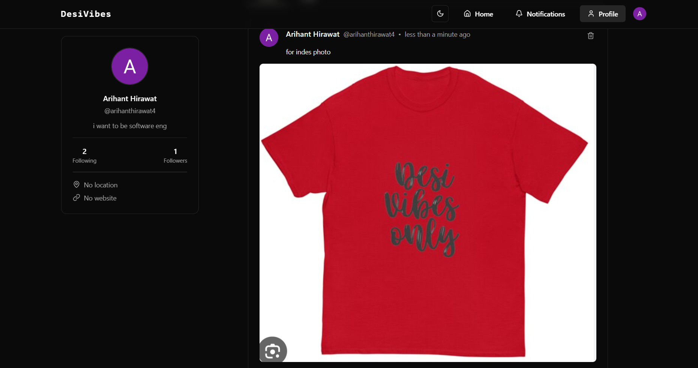

# 🌟 DesiVibes

A modern, full-stack **social media web app** where users can share thoughts, images, follow each other, and interact through likes & comments — all crafted with performance and style in mind.

 <!-- Optional image -->

> ✨ "Where Desi meets Digital — your own vibrant vibe space."  

---

## 🔥 Features

- 🔐 **Auth** powered by [Clerk](https://clerk.dev) (Google, Email, etc.)
- 📝 **Create posts** with text and image uploads
- ❤️ **Like & comment** on posts
- 👥 **Follow / Unfollow** other users
- 🔔 **Real-time notifications**
- 🧾 **User profile pages** with tabs for Posts & Liked content
- 🎨 **Elegant UI** with TailwindCSS & ShadCN components
- 📱 Fully **responsive & mobile-friendly**
- 📂 **Image uploads** with UploadThing + Next.js App Router
- ⚡ Server actions & caching with `revalidatePath` for blazing fast UX

---

## 🧠 Tech Stack

| Tech         | Description                               |
|--------------|-------------------------------------------|
| Next.js 14   | App Router, Server Actions, RSC           |
| TypeScript   | End-to-end type safety                    |
| TailwindCSS  | Utility-first styling                     |
| ShadCN UI    | Accessible & modern UI components         |
| Clerk Auth   | Drop-in authentication & user management |
| UploadThing  | Secure & customizable file uploads        |
| Prisma       | Type-safe ORM for PostgreSQL              |
| Render       | Hosting platform for backend & frontend   |

---

## 🖼️ Demo

🌍 [Live Website](https://desivibes.onrender.com)

> Login with Clerk and start vibing 🎉

---
##🤝 Contributing
Open to PRs and contributions! Feel free to fork, build cool features, and raise issues.
---
##🧑‍💻 Author
Made with ❤️ by Arihant Hirawat
---

## 🚀 Getting Started

Clone & run locally:

```bash
git clone https://github.com/yourusername/desivibes.git


cd desivibes
npm install
npx prisma generate
npx prisma migrate dev
npm run dev
